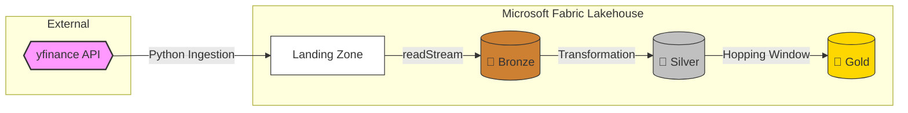
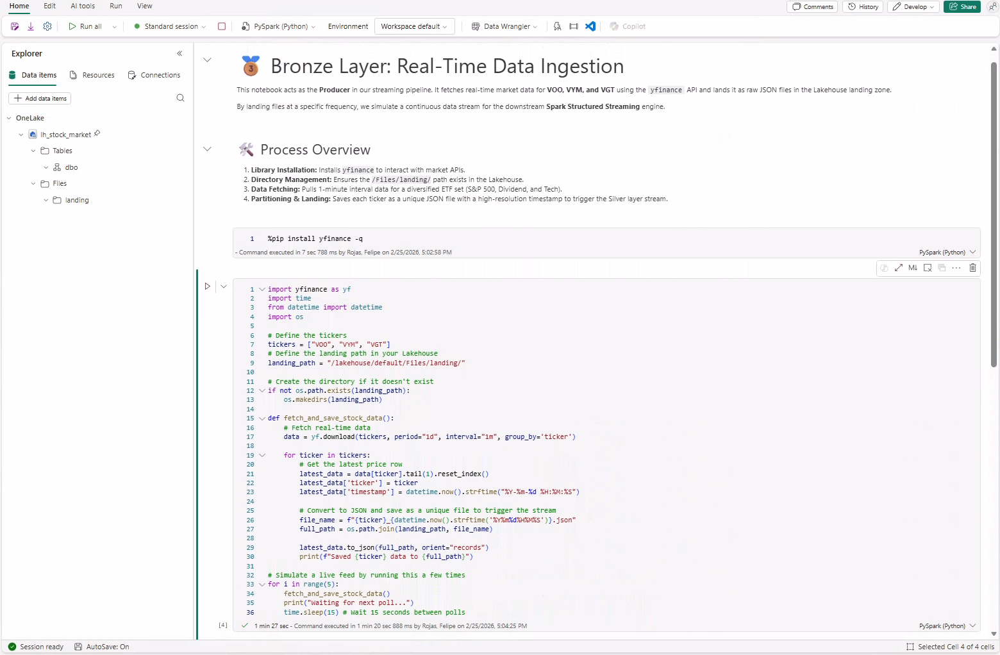
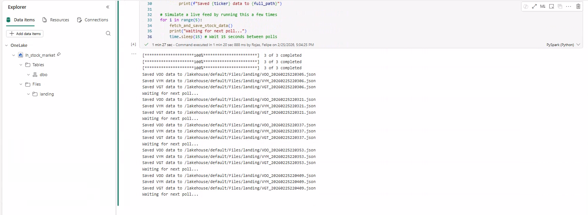
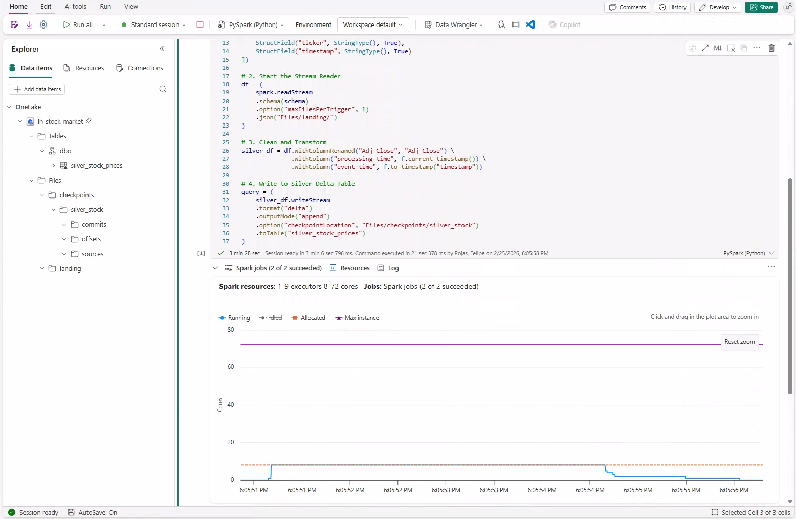
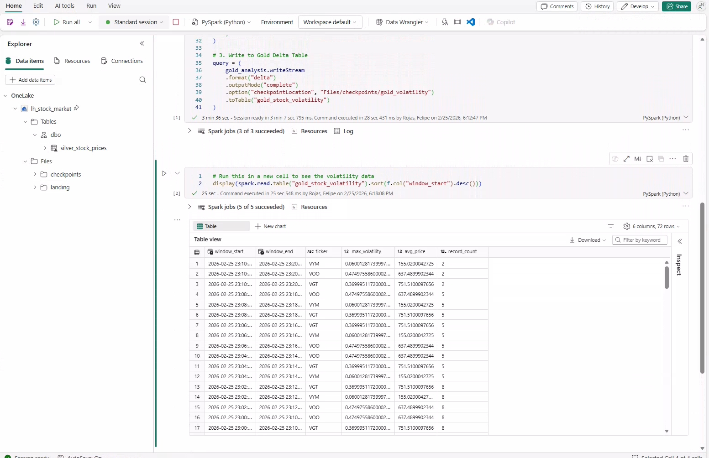
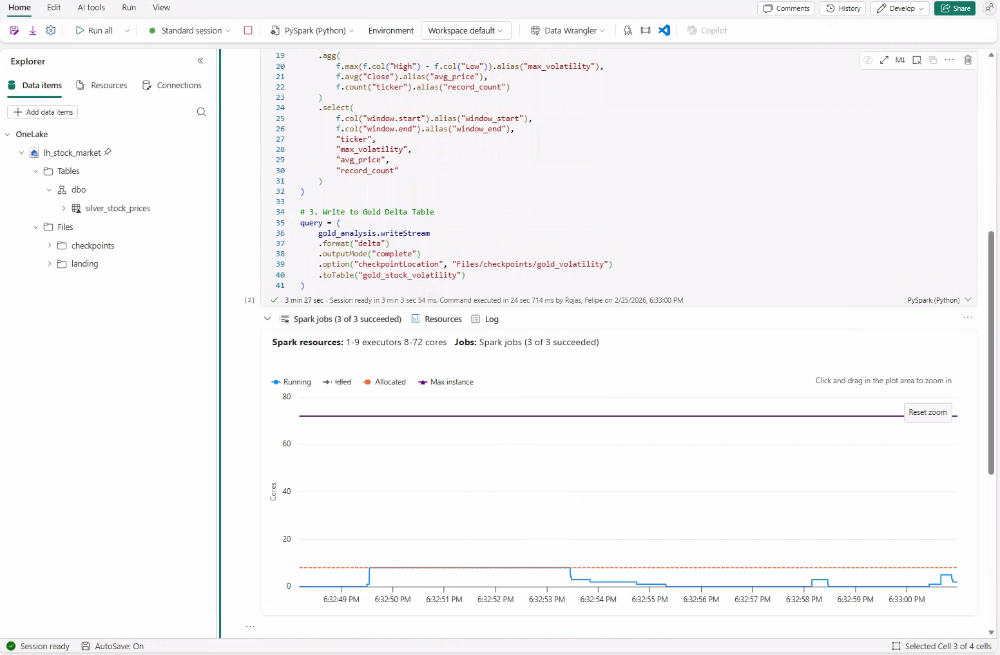

# 📈 Real-Time Stock Volatility with Spark Structured Streaming & MS Fabric

This project demonstrates a production-grade **Real-Time Streaming Pipeline** implemented using **Spark Structured Streaming** within **Microsoft Fabric**. It follows a **Medallion Architecture** to process live financial data (VOO, VYM, VGT), applying complex windowing functions to calculate market volatility on the fly.

---

## 🧠 Problem Statement

In fast-moving financial markets, batch processing often leads to "stale" insights. To identify volatility spikes as they happen, data engineers need a low-latency architecture that can ingest unstructured API data, enforce schemas in real-time, and perform stateful aggregations (Hopping Windows) without manual intervention.

---

## 🛠️ Tech Stack

- **Microsoft Fabric**: Unified platform for Lakehouse and Spark runtimes
- **Spark Structured Streaming**: Real-time engine for low-latency data processing
- **PySpark**: Distributed logic for streaming transformations and aggregations
- **Delta Lake**: ACID transactions and checkpointing for "exactly-once" semantics
- **yfinance API**: Real-time financial data source for diversified ETFs (VOO, VYM, VGT)

---

## 📁 Project Structure

```
real-time-stock-volatility-fabric/
├── notebooks/                  # PySpark notebooks for each streaming stage
│   ├── 01_Bronze_Ingestion.ipynb
│   ├── 02_Silver_Transformation.ipynb
│   └── 03_Gold_Analytics.ipynb
├── images/                     # Snapshots of streaming dashboards and results
└── README.md                   # Project overview
```

## 🏗️ Architecture & Snapshots



### 🥉 Bronze Layer: Real-Time Ingestion

A Python-based producer pulls live 1-minute interval data for VOO, VYM, and VGT. Data is landed as raw JSON files in the Lakehouse 'Files' section to simulate a continuous stream.

📸 **Snapshots**:



### 🥈 Silver Layer: Stream Processing & Cleaning

Implements `spark.readStream` to monitor the landing zone. It performs real-time schema enforcement, renames columns for Delta compatibility (e.g., `Adj_Close`), and adds event timestamps for temporal analysis.

📸 **Snapshot**:


### 🥇 Gold Layer: Hopping Window Analytics

The final analytical layer uses **Hopping Windows** (10-minute duration, sliding every 2 minutes) and **Watermarking** to calculate max price volatility (`High - Low`) and moving averages.

📸 **Snapshots**:



---

## 🚀 Key Insights & Features

- **Stateful Streaming**: Utilizes `withWatermark` to handle late-arriving data, ensuring the 10-minute window aggregations remain accurate even with network latency.
- **Micro-batch Optimization**: Configured `maxFilesPerTrigger` to simulate a "live" feel and manage compute resources effectively within Fabric.
- **Exactly-Once Semantics**: Integrated Checkpointing in all streaming sinks to prevent data loss or duplication in the event of a cluster restart.

---

## 🏅 Author & Certifications

**Felipe Castro**
Senior Data Analytics Engineer @ EPAM Systems

- 🏅 **[DP-700: Microsoft Certified: Fabric Data Engineer Associate](https://learn.microsoft.com/api/credentials/share/en-us/FelipeCastro-8026/96572499DF943EBC?sharingId=13D660F56C1DFFA3)**
- 🏅 **[DP-600: Microsoft Certified: Fabric Analytics Engineer Associate](https://learn.microsoft.com/api/credentials/share/en-us/FelipeCastro-8026/6C5A2F5A8A5864FC?sharingId=13D660F56C1DFFA3)**
- 🏅 **[PL-300: Microsoft Certified: Power BI Data Analyst Associate](https://learn.microsoft.com/api/credentials/share/en-us/FelipeCastro-8026/F853AABE365874B3?sharingId=13D660F56C1DFFA3)**

---

## 🚀 Tools & Tech


